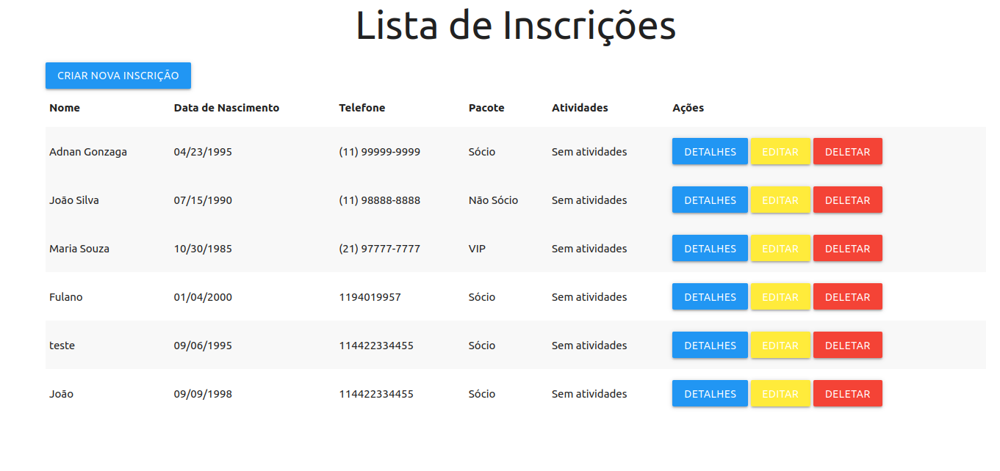

# UXEventos
Projeto de demonstração para processo da UXEventos

# Como executar o projeto
para executar o projeto, será necessário:

- Dotnet SDK 8.0+
- SQL Server 2022
- docker e docker-compose (opcional)

## Com docker compose

```bash
docker-compose up -d
```
a aplicação estará disponivel no localhost na porta 5040



## Com cli do dotnet

1 - vá até o projeto SucessoEventos.Web

```bash
cd SucessoEventos.Web
```

2 - Execute as migrações

```bash
dotnet ef database update
```

3 - Execute o projeto

```bash
dotnet run
```

